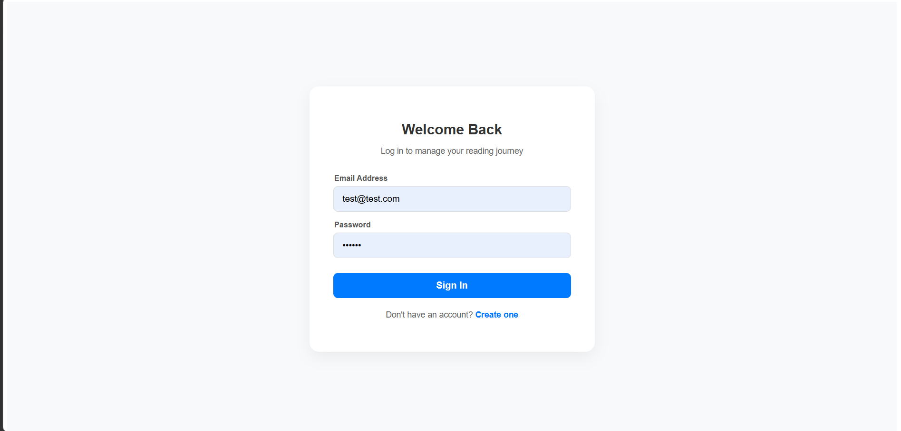
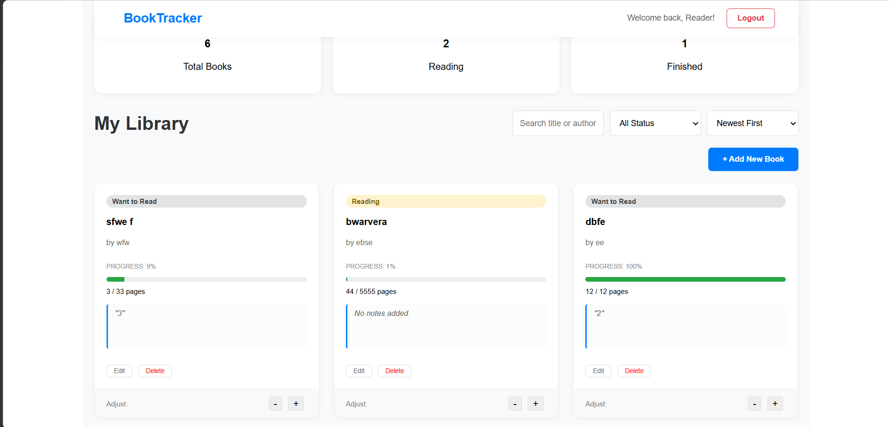
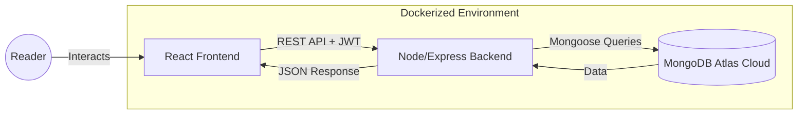
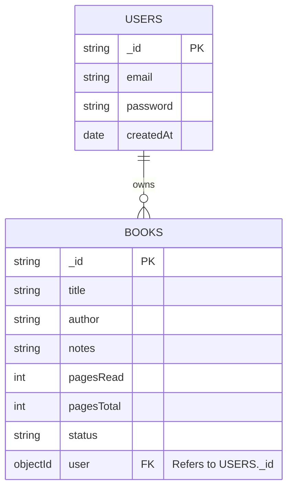
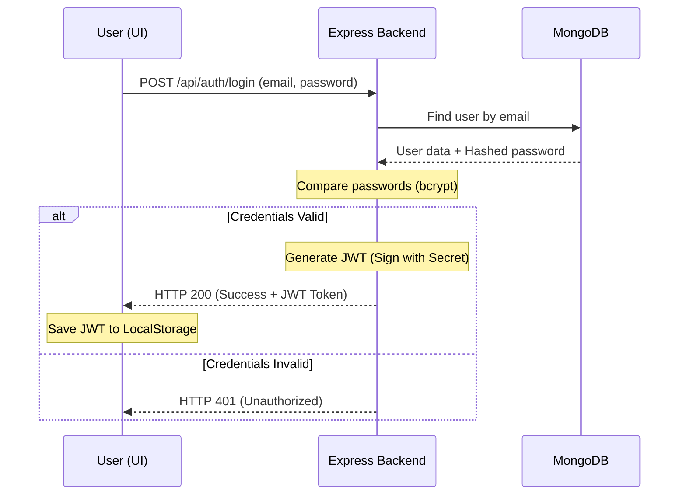

# Book Tracker Application

## 1\. Introduction

### Overview

The **Book Tracker App** is a specialized web application developed to provide users with a minimalist yet powerful tool for managing their personal libraries. Unlike broad social media platforms for readers, this application focuses on individual data privacy and granular progress tracking.

### Purpose

The primary objective of this project is to eliminate the complexity of book tracking by providing a centralized, secure interface where readers can catalog their literature, maintain private notes, and track their reading progress over time.

### Problem Description
Many readers struggle to consistently track their reading progress and organize their personal libraries. Existing solutions are often overly complex or include unnecessary social features.

This application solves that problem by providing a simple, private, and focused book tracking system.

### User Stories
- As a user, I want to register an account so that my data is saved securely.
- As a user, I want to log in to access my personal library.
- As a user, I want to add books with details such as title, author, and number of pages.
- As a user, I want to update my reading progress.
- As a user, I want to edit or delete books.
- As a user, I want to search and filter books by status.
- As a user, I want to store personal notes for each book.

### Mockups
> The interface design was inspired by modern minimalistic dashboards. You can view the interactive high-fidelity mockups here:
> **[UI Mockups on Figma](https://www.figma.com/make/6tT6TLUj0G4y3ad95xWE7I/Create-web-application-mockup?fullscreen=1&t=A6ci7gK3yONPe5iF-1)**

### Key Features

  * User authentication (login & registration)
  * Add, edit, and delete books
  * Track reading progress dynamically
  * Search and filter books
  * Responsive grid-based UI
  * Secure API with authentication middleware

-----

## 2\. Technologies Used

### Frontend

 * React (Vite)
 * Tailwind CSS

### Backend

 * Node.js
 * Express.js
 * JWT (JSON Web Tokens)

### Database

  * MongoDB Atlas
  * Mongoose

### Tools

  * Docker (deployment)
  * Git/GitHub (version control)
  * Postman (API testing)
  * VS Code

-----

## 3\. Getting Started

### Prerequisites

  * **Node.js** (v18 or higher)
  * **Docker Desktop** (for containerized execution)
  * **MongoDB Atlas Account** (for cloud database access)

### Cloning the Repository

```bash
git clone https://github.com/Elveseleven/book-tracker-app.git
cd book-tracker-app
```

### Installation & Preparation

1.  **Backend Setup:**
    ```bash
    cd backend
    npm install
    # Create a .env file based on .env.example
    ```
2.  **Frontend Setup:**
    ```bash
    cd ../frontend
    npm install
    ```

-----

## 4\. Usage Instructions

### Local Execution (Manual)

1.  Start the backend: `npm run dev` (running on port 5000).
2.  Start the frontend: `npm run dev` (running on port 5173).

### Local Execution (Docker)

Run the entire stack with one command:

```bash
docker-compose up --build
```

### Application Interface

> 
> *Description: The entry point where users securely authenticate.*

> 
> *Description: The primary view showing the user's personal book collection and status filters.*

-----

## 5\. Code and Configuration

### Repository Management

The development followed an iterative approach with 5 core milestones (C0-C4) documenting the evolution from environment setup to deployment configuration.

* **Sprint 1 (Milestones C0-C1):** Project initialization, Docker environment setup, and Backend skeleton (Express, Mongoose schemas, and Auth middleware).
* **Sprint 2 (Milestone C2):** Business logic implementation, including Authentication controllers and full Book CRUD functionality.
* **Sprint 3 (Milestone C3):** Frontend implementation using React, API integration, and UI styling with Tailwind CSS.
* **Sprint 4 (Milestone C4):**  Production orchestration, environment configuration, and deployment. This included finalizing Docker configurations for Render, resolving production host security policies, and completing the technical documentation with architectural diagrams.

  * **Repository URL:** [https://github.com/Elveseleven/book-tracker-app]
  * **Project Board:** [https://github.com/users/Elveseleven/projects/1/views/1] 

### Configuration Example (`.env.example`)

```text
PORT=5000
MONGO_URI=mongodb+srv://<user>:<password>@cluster.mongodb.net/BookTracker
JWT_SECRET=your_jwt_signing_key
```

-----

## 6\. Features

  * **Secure Authentication:** Password hashing using bcrypt and session management via JWT.
  * **Library CRUD:** Users can add books with specific metadata (Title, Author, Total Pages).
  * **Status Management:** Filterable categories including "Want to Read," "Reading," and "Finished."
  * **Notes System:** A dedicated field for users to save private reflections on each book.
  * **Progress Tracking:** Automatically calculates reading progress based on current and total pages, and visualizes it using a progress bar.
  
  ### Progress Calculation

The reading progress is calculated dynamically using the formula:

$$
\text{Progress \%} = \left( \frac{\text{Current Page}}{\text{Total Pages}} \right) \times 100
$$

---

## 7\. Code Structure

```
backend/
  controllers/
  models/
  routes/
  middleware/

frontend/
  src/
    pages/
    components/
    api/
```



### MVC Pattern Implementation
This project follows the **Model-View-Controller (MVC)** architectural pattern to ensure a clean separation of concerns, making the codebase maintainable and scalable.

#### **1. Models (The Data Layer)**
Located in `/backend/models`, these define the structure of the data in MongoDB.
* **User.js:** Defines the schema for authentication, storing usernames and hashed passwords.
* **Book.js:** Defines the schema for book entries. It includes a `userId` reference to link every book to a specific user, ensuring data isolation.

#### **2. Views (The Presentation Layer)**
Located in `/frontend/src`, the views are handled by **React components**.
* **Pages:** High-level views like `Login.jsx`, `Register.jsx`, and `Books.jsx`.
* **Components:** Reusable UI elements like `Navbar.jsx` and book cards.
* **Design:** The frontend uses a minimalist color palette implemented via **Tailwind CSS** to provide a calming user experience.

#### **3. Controllers (The Logic Layer)**
Located in `/backend/controllers`, these act as the "brain" of the application.
* **authController.js:** Handles the logic for registration and login, including password encryption and JWT generation.
* **bookController.js:** Manages the CRUD logic. It ensures that a user can only View, Edit, or Delete books that belong to their specific `userId`.

###  Architecture & Data Flow
The application utilizes a request-response cycle where the Frontend sends asynchronous requests via **Axios**, the Backend validates the request via **Middleware**, and the **Controllers** interact with the Database.

#### **Data Model Overview (ERD)**
The relationship between entities is **One-to-Many**: One user can own multiple book records.
* **User Entity:** `_id`, `username`, `password`.
* **Book Entity:** `_id`, `title`, `author`, `pagesRead`, `totalPages`, `status`, `owner`.

### Detailed Functionality Spotlight: Auth Middleware
To demonstrate "good programming practices," I implemented a custom **Authorization Middleware**. This security layer ensures that the application architecture is protected by design, preventing unauthorized access to user-specific data.

**Development Process:**
1. **Requirement:** Protect private endpoints (such as adding or deleting books) so that only logged-in users can access them.
2. **Logic:** The middleware acts as a "gatekeeper." It intercepts incoming HTTP requests, checks for the presence of a token in the headers, and validates it against the server's secret key.
3. **Implementation:**

```javascript
const jwt = require('jsonwebtoken');

// Middleware to verify JSON Web Tokens (JWT)
module.exports = (req, res, next) => {
  const token = req.headers.authorization;

  // 1. If no token is provided, block access immediately
  if (!token) return res.status(401).json({ error: "No token" });

  try {
    // 2. Verify the token using the secret environment variable
    const decoded = jwt.verify(token, process.env.JWT_SECRET);
    
    // 3. Attach the decoded user ID to the request object
    // This allows subsequent controllers to know exactly which user is acting
    req.user = decoded.id;
    
    // 4. Proceed to the next function (the controller)
    next();
  } catch {
    // 5. If verification fails (expired or tampered token), return an error
    res.status(401).json({ error: "Invalid token" });
  }
};
```
4. **Testing:** Verified behavior using Postman by sending requests with valid and invalid tokens.
5. **Edge Cases:** Handled missing token and expired token scenarios.



## 8\. Deployment

### Configuration Environment

The application is designed for containerized deployment using **Docker Compose**. This environment abstracts the OS-level dependencies, ensuring that the app runs identically on a developer's machine as it would on a production server.

### Deployment Steps

1.  **Configure Environment:** Populate the `.env` file with production credentials.
2.  **Orchestration:** Use `docker-compose up -d` to run the services in detached mode.
3.  **Hosting:** Hosting: The application is deployed and live on Render.
 **[Live Demo: Book Tracker App](https://book-tracker-frontend-db87.onrender.com)**

## 9\. Testing Documentation

| Feature | Test Case Description | Expected Result | Status |
| :--- | :--- | :--- | :--- |
| **Authentication** | Attempt login with unregistered email | 401 Unauthorized Error | Pass |
| **Authorization** | Access `/api/books` without a JWT token | 401 "No Token" Error | Pass |
| **Data Integrity** | Add book with `pagesRead` > `pagesTotal` | Validation error / Frontend Block | Pass |
| **CRUD Logic** | Edit a book title and save | DB updates and UI reflects change | Pass |
| **Privacy** | User A tries to access User B's book ID | 401 Unauthorized / Data Isolation | Pass |

## 10\. User Manual
1. **Registration:** Create an account with your email and a secure password.
2. **Dashboard:** Upon login, view your library. Use the "Add Book" button to create a new entry.
3. **Updating Progress:** Click "Edit" on any book card to update your current page. The progress bar will update automatically.
4. **Filtering:** Use the navigation tabs to switch between "All", "Reading", and "Completed" views.
5. **Notes:** Click on a book to read or edit your personal reflections in the Notes field.


